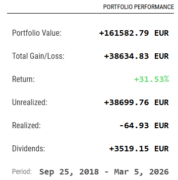

# MMM-ParqetPerformance

A [MagicMirror²](https://magicmirror.builders/) module that displays your stock portfolio performance from [Parqet](https://www.parqet.com/).

## Features

- Display portfolio performance metrics from Parqet API
- Show total return percentage
- Show absolute return in your currency
- Display current portfolio value
- Customizable update intervals
- Clean and responsive design
- Shows portfolio period

## Screenshot



The module displays:
- **Portfolio Value** - Current total value
- **Total Gain/Loss** - Combined unrealized + realized gains
- **Return** - Percentage return
- **Unrealized** - Gains from current holdings
- **Realized** - Gains from sold positions (if any)
- **Dividends** - Total dividends received (optional)
- **Fees** - Fees paid (optional)
- **Taxes** - Taxes paid (optional)
- **Period** - Date range of the data

All values are color-coded:
- 🟢 Green for positive values
- 🔴 Red for negative values

## Installation

1. Navigate to your MagicMirror's `modules` folder:
```bash
cd ~/MagicMirror/modules
```

2. Clone this repository:
```bash
git clone https://github.com/yourusername/MMM-ParqetPerformance.git
```

3. Navigate to the module folder:
```bash
cd MMM-ParqetPerformance
```

4. Install dependencies (if needed):
```bash
npm install
```

## Configuration

Add the module to your `config/config.js` file:

```javascript
{
	module: "MMM-ParqetPerformance",
	position: "top_right", // Choose your preferred position
	config: {
		apiToken: "YOUR_ACCESS_TOKEN", // Required - from OAuth
		portfolioIds: ["YOUR_PORTFOLIO_ID"], // Required - array of portfolio IDs
		updateInterval: 300000, // Update every 5 minutes (in milliseconds)
		intervalType: "ytd", // ytd, 1d, 1w, 1m, 3m, 6m, 1y, 3y, 5y, max
		header: "Portfolio Performance",
		displayCurrency: "EUR",
		showPercentage: true,
		showAbsolute: true,
		showMetrics: true,
		showDividends: true,
		showFees: false,
		showTaxes: false
	}
}
```

### Configuration Options

| Option | Type | Default | Description |
|--------|------|---------|-------------|
| `apiToken` | String | `""` | **Required.** Your OAuth access token from authorization |
| `portfolioIds` | Array | `[]` | **Required.** Array of portfolio IDs to track (e.g., `["abc123", "def456"]`) |
| `updateInterval` | Number | `300000` | Update interval in milliseconds (default: 5 minutes) |
| `intervalType` | String | `"ytd"` | Time period: `1d`, `1w`, `mtd`, `1m`, `3m`, `6m`, `ytd`, `1y`, `3y`, `5y`, `max` |
| `animationSpeed` | Number | `1000` | Speed of DOM animations in milliseconds |
| `header` | String | `"Portfolio Performance"` | Header text for the module |
| `displayCurrency` | String | `"EUR"` | Currency symbol to display |
| `showPercentage` | Boolean | `true` | Show percentage return |
| `showAbsolute` | Boolean | `true` | Show absolute gain/loss values |
| `showMetrics` | Boolean | `true` | Show performance metrics |
| `showDividends` | Boolean | `true` | Show dividend income |
| `showFees` | Boolean | `false` | Show fees paid |
| `showTaxes` | Boolean | `false` | Show taxes paid |

## Getting Your Parqet Access Token

### Step 1: Create an Integration
1. Sign up for a Parqet account at [parqet.com](https://www.parqet.com/)
2. Go to [developer.parqet.com/console/integrations](https://developer.parqet.com/console/integrations)
3. Create a new integration
4. Add a name and logo
5. Select scope: `portfolio:read`
6. Add redirect URI: `https://developer.parqet.com/docs/callback`
7. Save and copy your **Client ID**

### Step 2: Authorize and Get Access Token
1. Go to [developer.parqet.com/docs/api](https://developer.parqet.com/docs/api)
2. Click the **"Authorize"** button in the Authentication section
3. Enter your **Client ID**
4. Select scope: `portfolio:read`
5. Click "Authorize" and log in
6. Copy the access token shown
7. Add it to your MagicMirror config as `apiToken`

### Step 3: Get Your Portfolio IDs
Open Parqet in the web browser and you will see your in the URL https://app.parqet.com/p/<your_portfolio_id>
```bash
curl -H "Authorization: Bearer YOUR_ACCESS_TOKEN" https://connect.parqet.com/portfolios
```

## API Information

This module uses the [Parqet Connect API](https://developer.parqet.com/docs/api):
- Endpoint: `POST https://connect.parqet.com/performance`
- Authentication: OAuth2 Bearer token
- Request body: Contains `portfolioIds` and `interval` parameters
- Displays performance metrics including:
  - Portfolio valuation
  - Total gains/losses (unrealized + realized)
  - Return percentage
  - Dividends received
  - Optional: Fees and taxes

## Styling

The module includes default styling that works well with most MagicMirror themes. You can customize the appearance by editing `MMM-ParqetPerformance.css`.

Color coding:
- Positive returns: Green (#4ade80)
- Negative returns: Red (#f87171)

## Troubleshooting

### Module shows "Loading portfolio..."
- Check that your API token is correctly configured
- Verify your internet connection
- Check MagicMirror logs: `pm2 logs MagicMirror`

### Module shows "Please configure your portfolio IDs"
- You need to add at least one portfolio ID to the `portfolioIds` array
- Get your portfolio IDs using: `curl -H "Authorization: Bearer YOUR_TOKEN" https://connect.parqet.com/portfolios`

### Module shows "Error: API returned status 401"
- Your access token is invalid or expired
- Re-authorize using the API docs page to get a new token

### Module shows "Error: API returned status 403"
- Your token doesn't have the required `portfolio:read` scope
- Re-create your integration with the correct scope

### Module shows "Error: API returned status 429"
- You've exceeded the API rate limit
- Increase the `updateInterval` value in your config

## Dependencies

- MagicMirror² (v2.0.0 or later)
- Node.js built-in modules: `https`
- MagicMirror's `moment.js` library

## Contributing

Contributions are welcome! Please feel free to submit a Pull Request.

## License

MIT License

## Acknowledgments

- [MagicMirror²](https://magicmirror.builders/) for the amazing platform
- [Parqet](https://www.parqet.com/) for providing the portfolio tracking API

## Version History

### v1.0.0
- Initial release
- Integration with Parqet Connect API (OAuth2)
- Portfolio performance metrics display
- Multiple portfolio support
- Configurable time intervals (1d, 1w, 1m, 3m, 6m, ytd, 1y, 3y, 5y, max)
- Shows total gains (unrealized + realized)
- Displays dividends, fees, and taxes (optional)
- Color-coded gain/loss indicators
